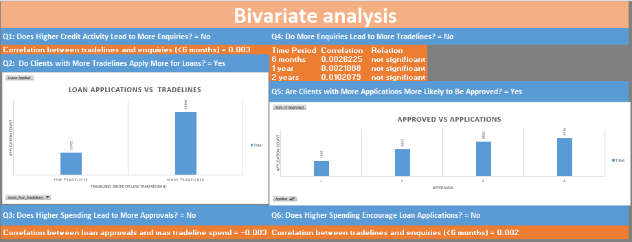
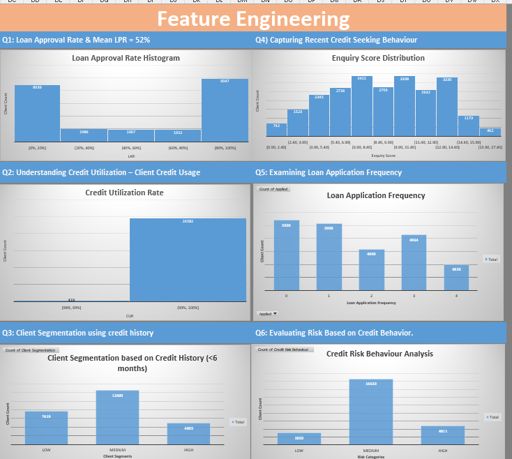
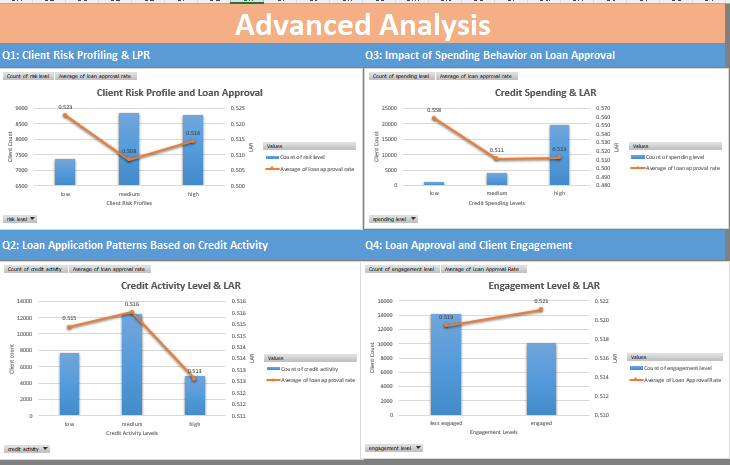

# Credit Behaviour Analysis and Risk Assessment

## Project Overview

This project analyzes client credit data to **improve loan approval processes, assess risk, and enhance customer engagement strategies** in the financial industry.The goal is to - 

- improve lending decisions
- reduce risk exposure
- enhance client profiling

## Data Sources

- **Base File**: Loan Application and Approval details [data/base_file.csv](data/base_file.csv)
- **Enquiry File**: Credit score checking [data/enquiry_data.csv](data/enquiry_data.csv)
- **Tradeline File**: Credit Activity [data/tradeline_data.csv](data/tradeline_data.csv)

## How to Use Solution

- Open [analysis/excel_analysis.xlsx](analysis/excel_analysis.xlsx)
- Navigate to the `Dashboard` sheet to view the visuals and insights.
- More visuals are available in the [`/visuals`](./visuals) folder. 

## Key Outcomes  
- **Improved Data Accuracy**: Identified and corrected inconsistencies, missing values, and outliers.  
- **Enhanced Risk Assessment**: Segmented clients into 3 risk categories(low/medium/high).  
- **Strategic Customer Segmentation**: Grouped clients by spending and credit activity.  
- **Actionable Insights**: Optimized loan approval process, developed business logic to detect risky clients. 

## In-depth Analysis

### 1. Univariate Analysis (Summary of Credit Behavior)
- Used Histograms for distribution analysis
- Summary table for statistical analysis of key metrics

### 2. Bivariate Analysis (Relationship between any 2 variables)
- Implement Joins (Power Query) to merge the original 3 datasets

### 3. Feature Engineering (New Variables)
- utilized Excel lookups, if(), etc to create new columns

### 4. Advanced Analysis (Multivariate analysis - What influences Loan Approval?)
- built 3 variable analysis visuals from the new features
- explored relation of Loan Approval Rate with multiple factors

